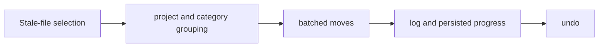

# Workspace Automation Scripts — Project Brief

## At a glance

| Field | Value |
|---|---|
| Portfolio area | Developer operations |
| Repository | [jjshay/skills](https://github.com/jjshay/skills) |
| Status | Source available; runtime not revalidated in this documentation review |
| Evidence review | 2026-09-11; [commit fbd3399](https://github.com/jjshay/skills/tree/fbd3399b9c1f6e8cdbb8780e9d2559e6dc3eeccc) |

## Problem and intended value

Drive organization needs repeatable batching, an execution record, and a way to reverse changes.

The intended value is a repeatable workflow whose inputs, transformations, and outputs can be inspected. Use the evidence below to distinguish implementation from business outcomes.

## Architecture and data flow

Stale-file selection → project and category grouping → batched moves → log and persisted progress → undo.

## Implementation evidence

| Source | Reading purpose |
|---|---|
| [google-drive-organizer/Code.gs](../google-drive-organizer/Code.gs) | Implementation component supporting the data flow described above. |

The links above point to the current repository. The review reference identifies the version used to prepare this brief.

## Setup and operation

Use the existing [README](../README.md) for setup and operating commands. Configuration and dependency references: the source entry points and the existing README.

Start with sample or fixture inputs. Where external services are involved, configure a test account and check the distinction between a local preview, a generated artifact, and a remote write. Credentials and operational datasets are environment-specific.

## Validation and outcomes

**Review result:** Repository tree and referenced source reviewed. Existing application tests, hosted deployments, paid providers, and external mutations were not re-run in this documentation review.

No conventional test suite was identified in the reviewed repository tree; validation should begin with the next improvement below.

The source implements the workflow described above. No new revenue, accuracy, conversion, or production-uptime result is asserted by this documentation update.

Documentation itself is checked by `python3 scripts/check_project_docs.py`; that check validates this structure and its source references, not application behavior.

## Decisions and limitations

Batching works within execution limits, while reversal depends on preserving original file locations.

Keep provider-dependent observations dated and separate from deterministic transformations. State which assumptions a demonstration uses and which integrations it actually exercises.

## Interview talking points

- **Problem and product judgment:** Explain why this workflow mattered to its intended operator: Drive organization needs repeatable batching, an execution record, and a way to reverse changes.
- **Technical walkthrough:** Trace one concrete input through this sequence: Stale-file selection → project and category grouping → batched moves → log and persisted progress → undo.
- **Engineering tradeoff:** Batching works within execution limits, while reversal depends on preserving original file locations.
- **Evidence and ownership:** Open the source links above, identify the specific design or implementation decisions you personally drove, and distinguish AI-assisted implementation from measured operating results.
- **What comes next:** Demonstrate dry-run, interrupted continuation, and undo on an isolated test folder.

## Next improvements

Demonstrate dry-run, interrupted continuation, and undo on an isolated test folder.

Record any follow-up result with a date, exact command or evaluation method, input scope, observed output, and limitations. Update `project.json` alongside this brief.

## Related projects

- [Clawhub Configuration Sync](https://github.com/jjshay/clawhub) — Developer operations.

Some related repositories require authorized GitHub access.
